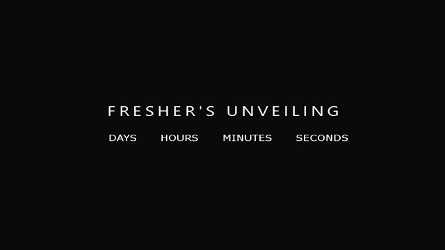

# [Countdown Example](https://akashpawara.github.io/countdown/) 

 [](https://discordapp.com/users/228556195689005059) [](https://www.linkedin.com/in/akashpawara) 
 
 

To Change date & time of the countdown,  
GO TO count.js => Line 6   
```
        let countDown = new Date('June 13, 2020 00:00:00').getTime(), // Month day, year HH:MM:SS
```
Change Date and time according to the commented format  

To check out live demo, [Click here](https://akashpawara.github.io/countdown/)

You can also [check out](https://github.com/akashpawara/college-fest-landing-page) this repository where this countdown is used to build a college fest landing page. 

## Table of Contents

* [Quick Start](#quick-start)
* [Technical Support or Questions](#technical-support-or-questions)
* [Social Media](#social-media)

## Quick start

- Clone the repo: `git clone https://github.com/akashpawara/countdown.git`.


## Technical Support or Questions

If you have questions or need help integrating the product, [contact me](https://api.whatsapp.com/send?phone=917506021898) me on whatsapp or email me at (akashpawara29@gmail.com).


## Social Media

Linkedin: <https://www.linkedin.com/in/akashpawara>

Medium: <https://medium.com/@akashpawara>

Instagram: <https://instagram.com/akash_pawara_>

Whatsapp: <https://api.whatsapp.com/send?phone=917506021898>